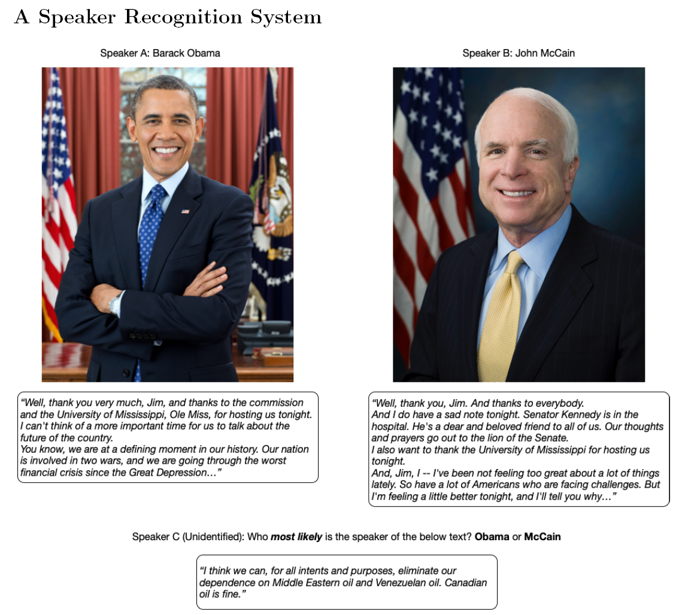

# markov-recognition
Speaker recognition system utilizing Markov models (as well as a custom hash table). Final project for Python Programming course at UChicago.
* This program utilizes Markov models to determine which of two given speakers is more likely to have spoken the unknown text.

To run:
1. Unzip the speaker files
2. Cd into the main directory
3. Normal mode: This mode will run the markov program and output to the console which speaker was more likely to have originated the unknown text. The driver.py file requires 5 command line arguments to run the program in normal mode. The first argument is a text sample file from the first speaker, the second argument is a text sample file from the second speaker, the third argument is a text sample file from an "unknown" speaker (to be tested), the fourth argument is an integer k (the order of the Markov models to be used- usually 2 or 3), and the fifth argument is an integer 0 or 1, which corresponds to the model utilizing a custom hashtable or the built in Python dictionary. Example: ```ipython driver.py speeches/bush1+2.txt speeches/kerry1+2.txt speeches/bush-kerry3/BUSH-0.txt 2 1```
4. Performance mode: This mode tests the performance of the custom hash table against the built in Python dictionary. The driver.py file requires 6 command line arguments. The first argument is 'p', followed by a text sample file from the first speaker, a text sample file for the second speaker, a text sample file from an unknown speaker, the k value (as described above, and finally an integer representing the number of times the program will run (on both the built in dictionary and custom hash table). Example: ```ipython driver.py p speeches/bush1+2.txt speeches/kerry1+2.txt speeches/bush-kerry3/BUSH-0.txt 3 2``` In performance mode, rather then printing the result to the console, the program will output a graph to the same directory as the driver called 'execution_graph.png'. This graph shows the relative performance per k value for each of the implementations, averaged over the number of runs (see below).
